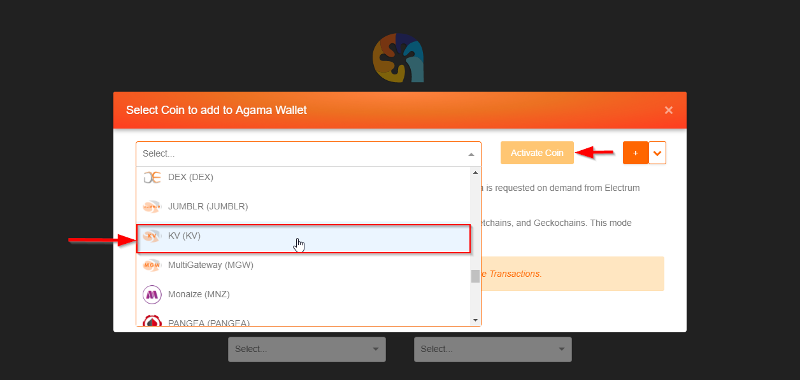
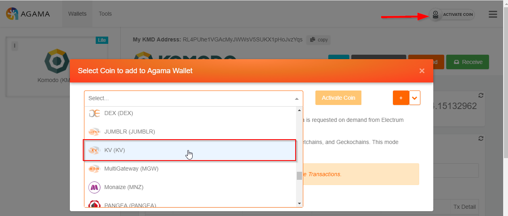
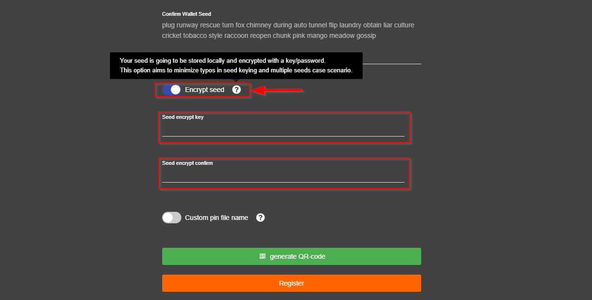
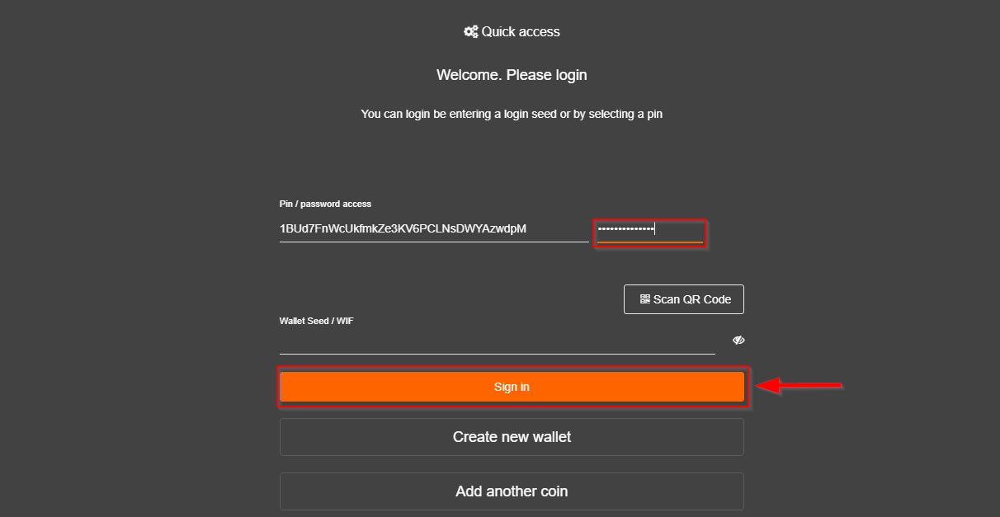
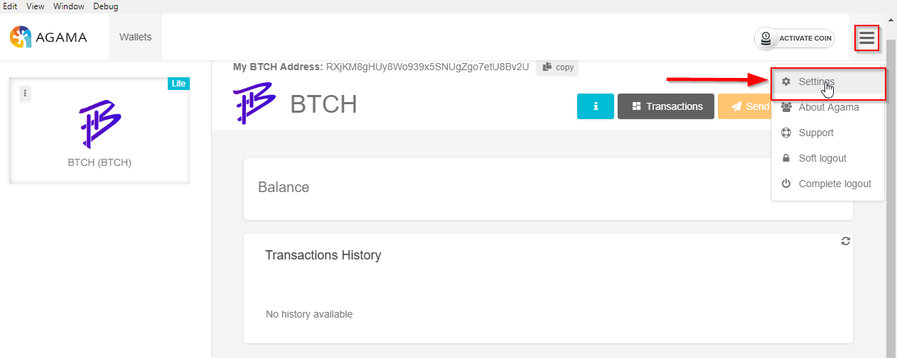
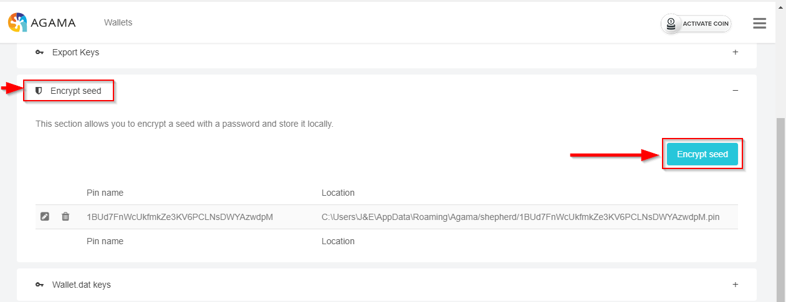
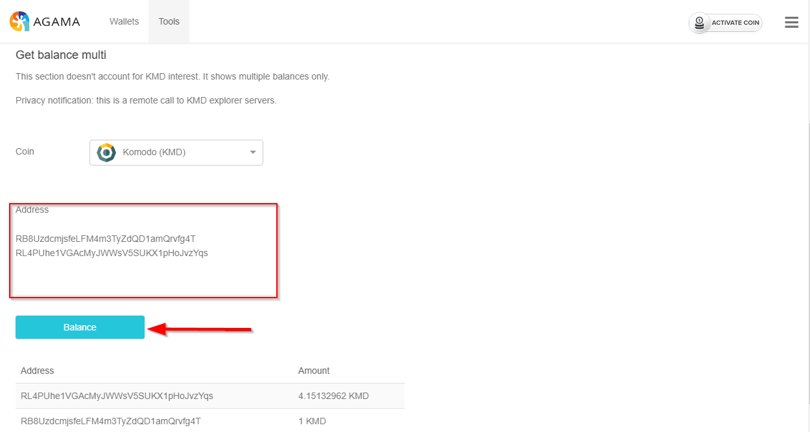

*********************
Agama-v0.2.36-Updates
*********************
**Under Construction**
	
1. Kv spv

a. Open Agama

b. Select the Activate coin button

.. image:: images/Agama-v0.2.36/image1.png
   :align: center
   :scale: 75 %

c. The coin activation popup window will appear. Select KV from the coin drop down then select Activate Coin

d. The above steps may also be reached by logging into Agama with any coin and once on the Transactions page select the Activate Coin button on the top right of the screen

2. Native-gen param - **Dev only**

3. SPV watch only address mode ui flag

a. Open Agama and login using a public coin address

b. Once the Transactions screen is displayed hover your mouse over the question mark icon in the top right of the page (beside the Receive button)

.. image:: images/Agama-v0.2.36/image4.png
   :align: center
   :scale: 75 %

4. Interest calc edge case fi

5. Improved seed encryption

a. Open Agama wallet and login with desired coin. Encrypt seed (during wallet creation)

b. Select the Encrypt Seed toggle button, two fields will appear for the user to enter a key/passphrase. Enter key/passphrase then select Register

c. A login page will now appear prompting for key/passphrase entry, enter the created key/passphrase then select Sign In

Encrypt Seed (after wallet creation)

a. Open Agama wallet and login with desired coin

b. In the top right corner of the page select the menu button (three horizontal lines) then select Settings

c. Select the Encrypt Seed section then the Encrypt Seed button

d.   Enter created seed then enter a key/passphrase and select Encrypt

.. image:: images/Agama-v0.2.36/image10.png
   :align: center
   :scale: 75 %

6. New ac chain

7. Tools -> get multiple kmd balances

a. Open Agama and log in with KMD coin (ensure advanced features are enabled)

b. Select the Tools menu option the select the KMD Balance (multi address) button

.. image:: images/Agama-v0.2.36/image12.png
   :align: center
   :scale: 75 %

c. In the Address field enter (on separate lines) two KMD public addresses then select the Balance button. The address and balance will display below the selected Balance button

8. Experimental support for custom asset chains, staking and mining
