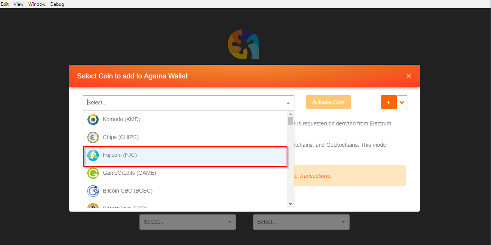
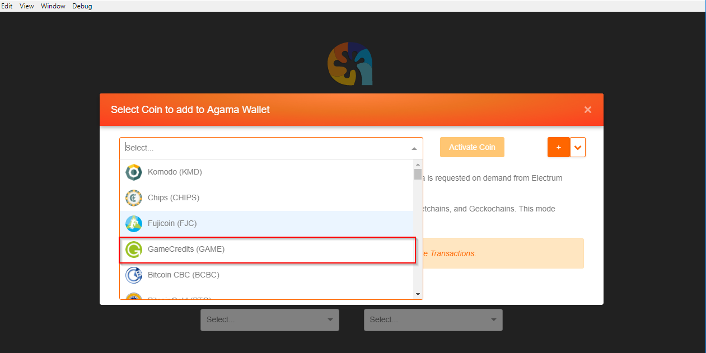
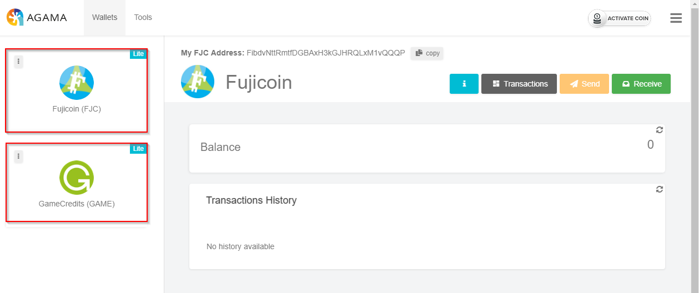
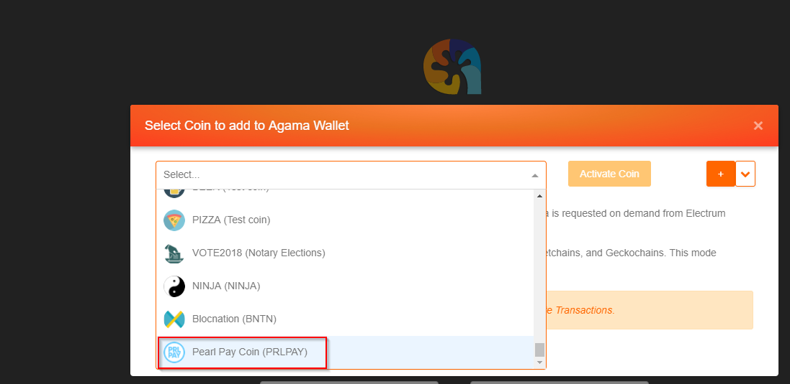
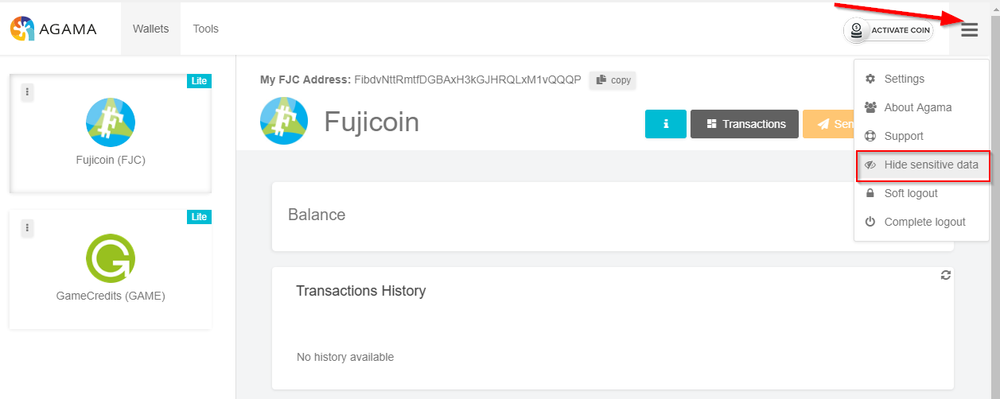
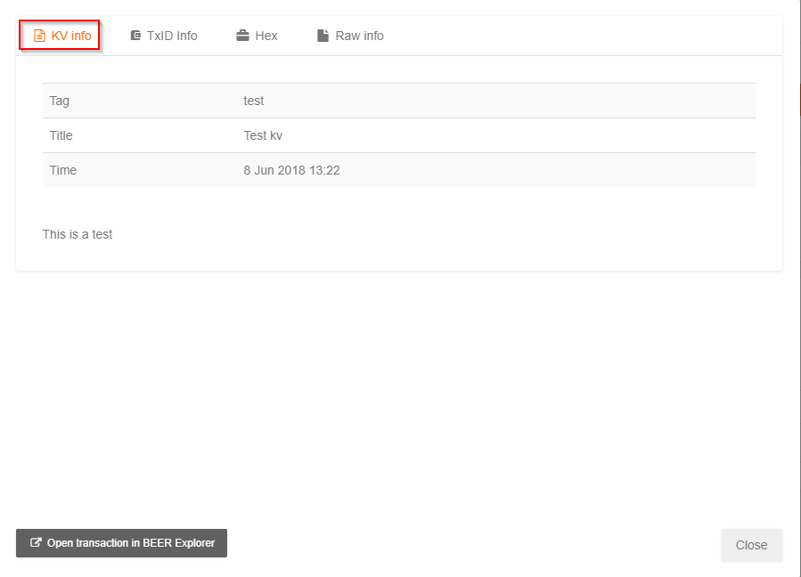

*********************
Agama-v0.2.39-Updates
*********************

1. New spv coins game and fujicoin (fjc)

a. New Fugicoin in initial activate coin screen

b. New GameCredits (GAME) in initial activate coin screen

c. Both new coins in a single wallet

2. New asset chain prlpay

a. Pearl Pay (prlpay) has been added to the coin list SPV

3. Spv socket timeout settings option

a. New socket timeout option added to Settings -> App Config

.. image:: images/Agama-v0.2.39/image5.png
   :align: center
   :scale: 75 %

4. Sensitive data blur toggle

a. A new Menu option “Hide sensitive data” has been added, to show the data again reselect the menu option then select “Show sensitive data”

b. The public address will now be blurred out

.. image:: images/Agama-v0.2.39/image7.png
   :align: center
   :scale: 75 %

5. KV Lite

a. KV view screen has been added to the Transaction screen for KV, BEER, and PIZZA coins

.. image:: images/Agama-v0.2.39/image8.png
   :align: center
   :scale: 75 %

b. In the send screen the Send KV button has been added allowing the user to enter a Tag, Title, and Content message

.. image:: images/Agama-v0.2.39/image9.png
   :align: center
   :scale: 75 %

c. Once created the kv tx will now appear in the kv view, select the blue content icon to view it's contents

.. image:: images/Agama-v0.2.39/image10.png
   :align: center
   :scale: 75 %

d. From the content icon the send kv info may be viewed

