*********************
Agama-v0.3.3a-Updates
*********************

Enhancements
============

1. Navigate to native folder option· `Github details <https://github.com/KomodoPlatform/Agama/issues/167>`__

a. The following new options have been added to the Debug menu in Agama: Contact help desk, Add Github issue, Show Agama data folder, Show Komodo data folder, Show komodo-cli folder

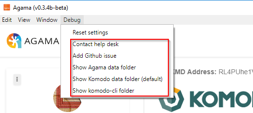

b. The Contact help desk option will open the following URL: https://support.komodoplatform.com/support/tickets/new

c. The Add Github issue option will open the following URL: https://github.com/KomodoPlatform/Agama/issues/new

d. The Show Agama data folder option will open the following folders in their respective OS:

    * Windows: %appdata%Roaming/Agama
    * Linux: ~/.Agama
    * Mac: ~/Library/Application Support/Agama

e. The Show Komodo data folder option will open the following folders in their respective OS:

    * Windows: %appdata%Roaming/Komodo
    * Linux: ~/.komodo
    * Mac: ~/Library/Application Support/Komodo

f. The Show komodo-cli folder option will open the following folders in their respective OS:

    * Windows: C:\Program Files\AgamaApp\resources\app\assets\bin\win64
    * Linux: ~/.komodo/zcutil
    * Mac: ~/Library/Application Support/Komodo

2. Add change log

a. The Agama change log listing all updates per version is now available. To view the change log select the menu button in the top right of the screen then select Change log

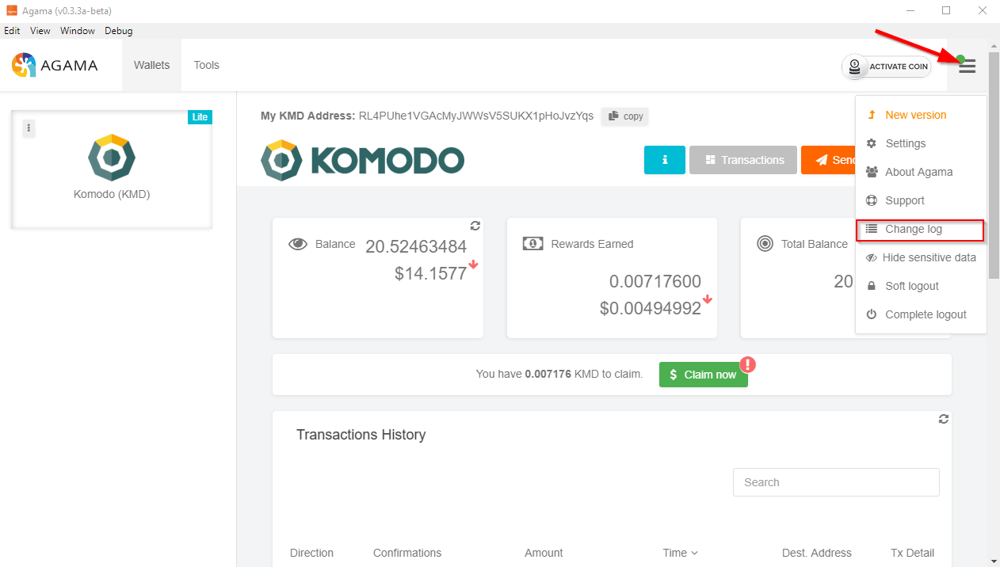

b. Once selected the change log will appear in its own screen

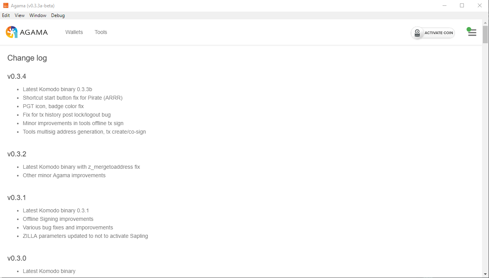

3. Add Name column for Receiving address

a. Address book functionality is now available in Lite (SPV) mode. To create a new address book entry select Settings from the top right menu. Once in Settings select the Address book section at the bottom of the page then select the ‘Create New Entry’ button

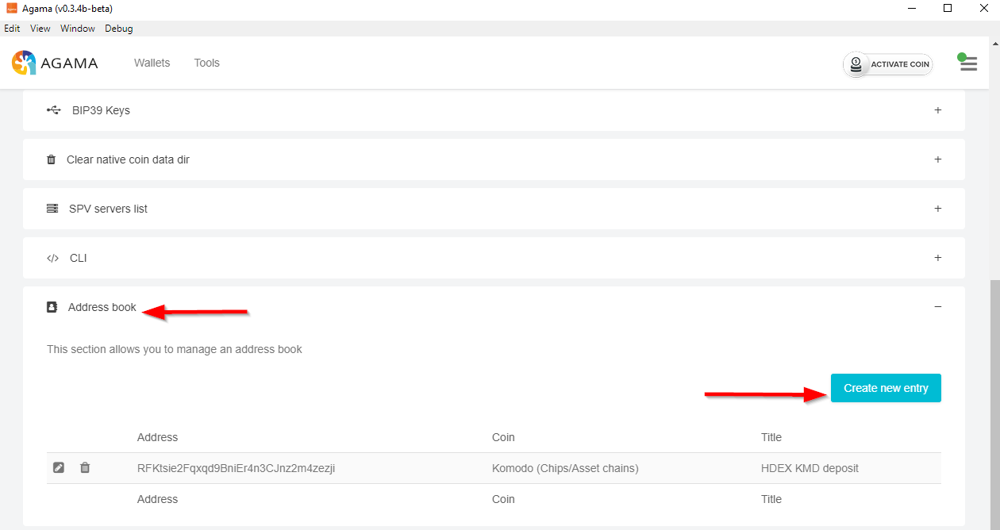

b. After selecting Create New Entry two fields will appear. Enter desired address and title (what you want to call the address) then select Save

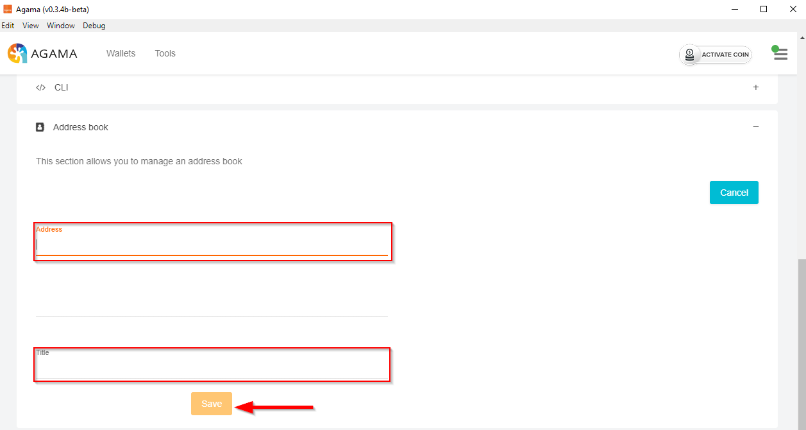

c. Now, with your saved address the title of that address will be displayed in the Transaction section of the wallet

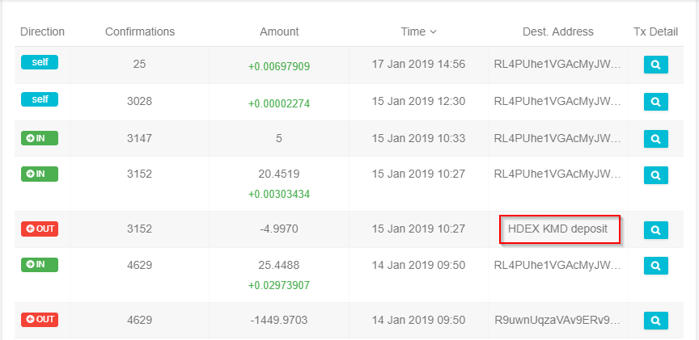

4. Tools multisig address generation, tx create/co-sign

a. Multisig address generation and signing are now available via the Tools menu in Agama. Multisig options may be executed in both Lite (SPV) and Native modes. For a detailed guide on multisig functionality please follow the below links
    * :doc:`Create multisig address <../create-multisig-address>`
    * :doc:`Sign multisig transaction <../sign-multisig-transaction>`

5. Debug log dump generation

a.The ability to download the Agama debug log may now be found in the Settings -> Debug section. Once in the Debug section select the “Get debug log dump” button

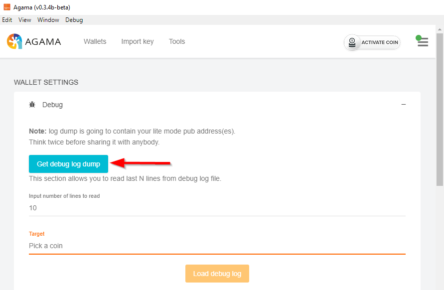

b. Once selected a file browser will appears. Select the desired location you wish to save the log then select Save

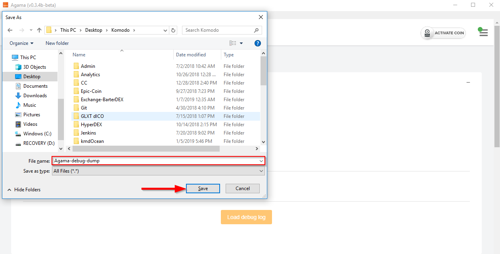

6. Offline Signing

a. Offline signing (ie: transactions involving one computer with no internet access) is now available via the Tools menu in Agama.For a detailed guide on completing an offline signing transaction please follow the below link

    * `Offline signing guide <https://support.komodoplatform.com/support/solutions/articles/29000026631-sign-transactions-offline-and-broadcast-online-using-agama>`__

7. dPOW confirmation icon in transactions history

a. A new icon in the transaction history has been added (in both SPV and Native modes) indicating whether dPOW is supported for the token

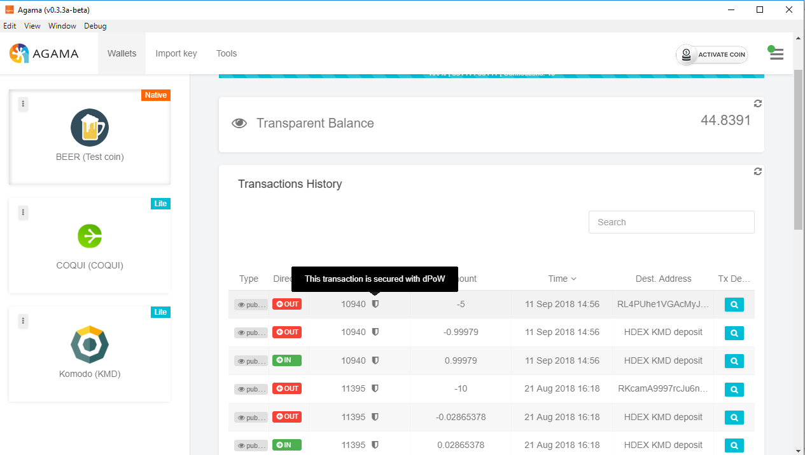

8. ETH and ERC20 token support

a. All tokens that are supported in BarterDEX are now available in Agama (over 150 new tokens). For the full list please select the below link

    * `ETH and ERC20 token list <https://komodoplatform.com/komodo-integrates-eth-erc20-tokens-to-agama-wallet/>`__

9. Added SUQA, Bitzec, LUMBER

a. Note: To activate any new non Komodo asset chain token you must activate advanced features first. The guide to accomplish this can be found here: `Agama-Activate advanced features <https://support.komodoplatform.com/support/solutions/articles/29000024423-activate-advanced-features>`__

b. SUQA - Lite mode only
                
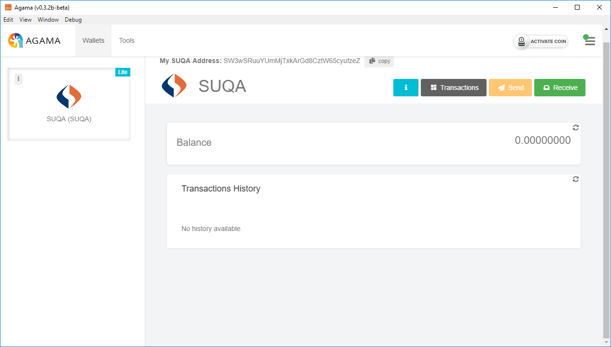

c. Biztec - Lite mode only
                
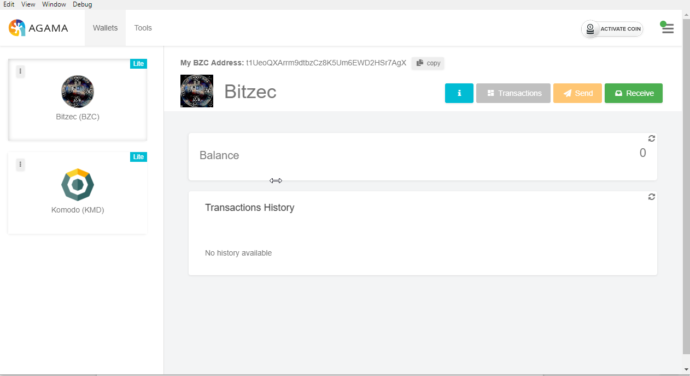

d. LUMBER - Lite and Native available

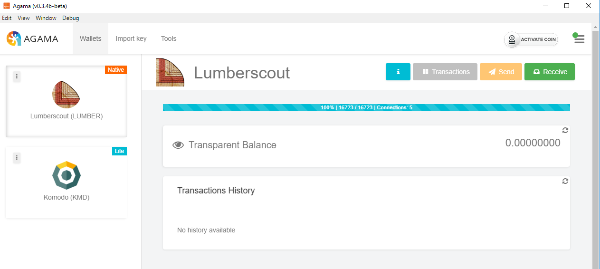

Fixes
=====

    * CLI display bug fixed
    * Login add coin shortcuts PIRATE fix
    * PGT icon, badge color fix
    * tx history post lock/logout bug fix
    * CLI cmd error fix `Github #194 <https://github.com/KomodoPlatform/Agama/issues/194>`__
    * Address book - invalid address fix `Github #187 <https://github.com/KomodoPlatform/Agama/issues/187>`__
    * LUMBER - send error fix `Github #191 <https://github.com/KomodoPlatform/Agama/issues/191>`__

Dev Only
========

    * Latest Komodo binary (`release notes <https://github.com/KomodoPlatform/komodo/blob/master/doc/release-notes/release-notes-0.3.0.md>`__)
    * Coin pricing update
    * Removed BCBC and ARG
    * Minor improvements in tools offline tx sign

