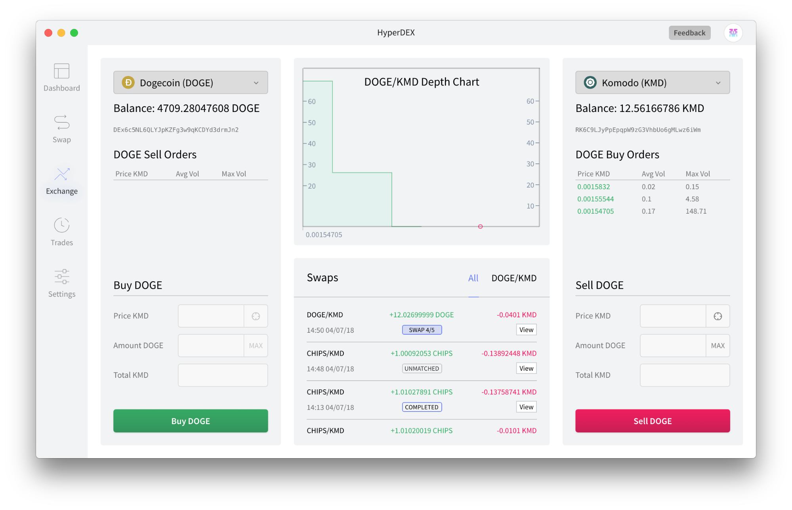

************************************
HyperDEX-0.1.0-alpha.10-Enhancements
************************************

1. Automatically fix stuck swaps. `Commit Details <>`_
This PR resolves the issue of users getting swaps that are stuck mid swap (e.g in `swap 3/5` state). For more detail select the “Commit Details” link

Add ability to view the portfolio seed phrase. Commit Details
The ability to view the portfolio seed phrase has been added to the Settings view. Once in the Settings view select the “View Seed Phrase” button

Once selected you will be prompted to enter your password. Enter your portfolio password then select Submit

After a successful password entry the portfolio seed phrase will now be displayed

Add ability to rename and delete the portfolio. Commit Details
To rename the portfolio go to Settings then edit the Name field at the top of the section

To delete the portfolio go to Settings then select the Delete Portfolio button

Once selected, a prompt will appear. Enter your portfolio name then select
“I understand, delete this portfolio”

Add GLX Token (GLXT) currency. Commit Details
GXLT added to Settings coin list

GXLT available in the Dashboard view

GLXT available in the Exchange

Add Chainmakers (CHAIN) currency. Commit Details
CHAIN coin added to Settings coin list

CHAIN available in Dashboard view

CHAIN added to the Exchange view

Add PACcoin ($PAC) currency. Commit Details
$PAC coin added to Settings coin list

$PAC coin added to the Dashboard view

$PAC coin added to the Exchange view

Add Rapture (RAP) currency. Commit Details
RAP coin added to the Settings coin list

RAP coin added to the Dashboard view

RAP coin added to the Exchange view

Update some Electrum servers.Dev Only Commit Details
Reset inputs in the Exchange view when currency changes. Commit Details
When changing currencies in the Exchange view, in either Buy or Sell sections, all inputs will now be cleared

Update to BarterDEX Marketmaker v1.0.315. Commit Details

Fixes

Fix order selection calculation. Commit Details
A fix has been implemented to increase the order match rate
Fix Portfolio menu being visible even when logging out. Commit Details
Fix the dropdown of the currency selector being cut off and make settings scrollable. Commit Details
The Setting view now includes an inner scroll which now allows an easy view of all options, including the theme setting and logout option

