************************************
HyperDEX-0.1.0-alpha.10-Enhancements
************************************

1. Automatically fix stuck swaps. `Commit Details <https://www.google.com/url?q=https://github.com/atomiclabs/hyperdex/commit/1d4a0bc7a193f72a82d52077fd3f5f6f545e930c&sa=D&ust=1532159827390000>`__
This PR resolves the issue of users getting swaps that are stuck mid swap (e.g in `swap 3/5` state). For more detail follow the link `Commit Details <https://www.google.com/url?q=https://github.com/atomiclabs/hyperdex/commit/1d4a0bc7a193f72a82d52077fd3f5f6f545e930c&sa=D&ust=1532159827390000>`__ 

2. Add ability to view the portfolio seed phrase. `Commit Details <https://www.google.com/url?q=https://github.com/atomiclabs/hyperdex/commit/5634172785a5b22ad7f6308a316701dd10ffda2d&sa=D&ust=1532159827391000>`__

a. The ability to view the portfolio seed phrase has been added to the Settings view. Once in the Settings view select the “View Seed Phrase” button

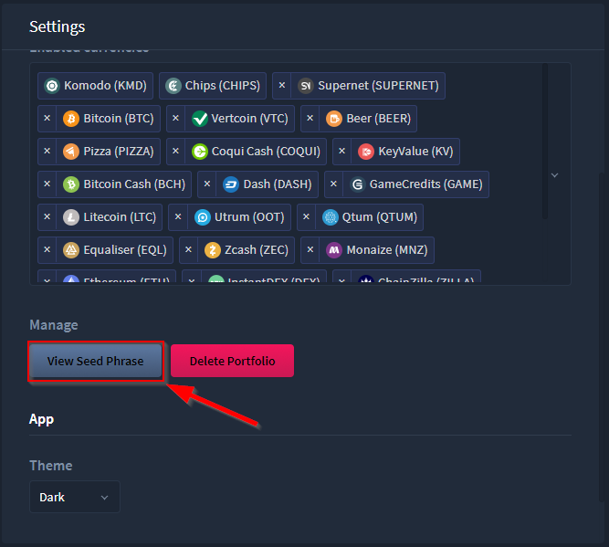

b. Once selected you will be prompted to enter your password. Enter your portfolio password then select Submit.

.. image:: images/HyperDEX-0.1.0-alpha.10/image2.png
   :align: center
   :scale: 75 %

c. After a successful password entry the portfolio seed phrase will now be displayed

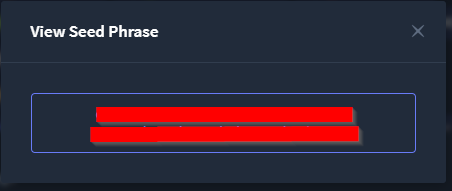

3. Add ability to rename and delete the portfolio. `Commit Details <https://www.google.com/url?q=https://github.com/atomiclabs/hyperdex/commit/5634172785a5b22ad7f6308a316701dd10ffda2d&sa=D&ust=1532159827393000>`__

a. To rename the portfolio go to Settings then edit the Name field at the top of the section

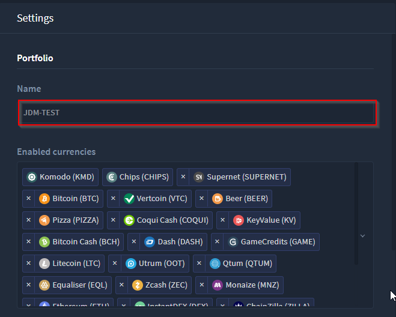

b. To delete the portfolio go to Settings then select the Delete Portfolio button

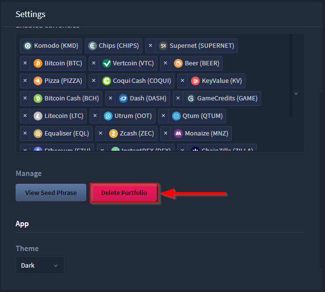

c. Once selected, a prompt will appear. Enter your portfolio name then select
“I understand, delete this portfolio”

.. image:: images/HyperDEX-0.1.0-alpha.10/image6.png
   :align: center
   :scale: 75 %

4. Add GLX Token (GLXT) currency. `Commit Details <https://www.google.com/url?q=https://github.com/atomiclabs/hyperdex/commit/9ddb1f3345d02dd1a0933ed7f58aaaf865770592&sa=D&ust=1532159827394000>`__

a. GXLT added to Settings coin list

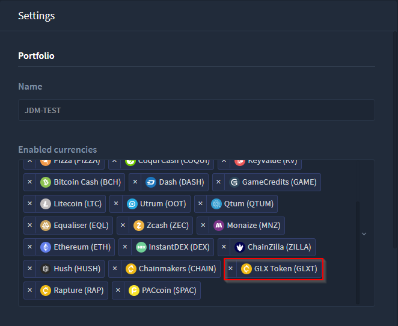

b. GXLT available in the Dashboard view

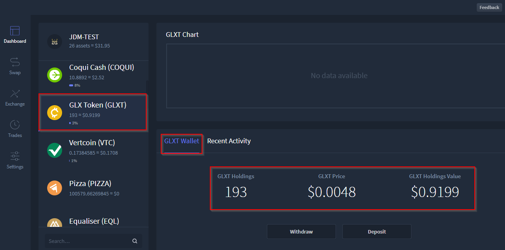

c. GLXT available in the Exchange

.. image:: images/HyperDEX-0.1.0-alpha.10/image9.png
   :align: center
   :scale: 75 %

5. Add Chainmakers (CHAIN) currency. `Commit Details <https://www.google.com/url?q=https://github.com/atomiclabs/hyperdex/commit/8fc85bc6f53a62394b54ead4b0032fdc4cf11a38&sa=D&ust=1532159827396000>`__

a. CHAIN coin added to Settings coin list

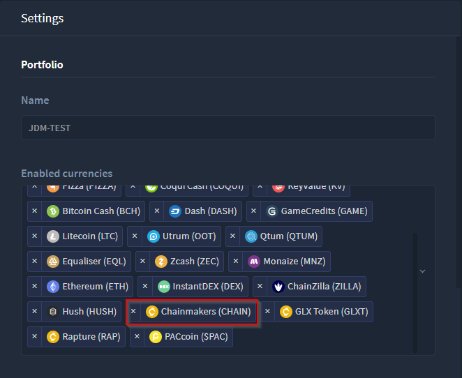

b. CHAIN available in Dashboard view

.. image:: images/HyperDEX-0.1.0-alpha.10/image11.png
   :align: center
   :scale: 75 %

c. CHAIN added to the Exchange view

.. image:: images/HyperDEX-0.1.0-alpha.10/image12.png
   :align: center
   :scale: 75 %

6. Add PACcoin ($PAC) currency. `Commit Details <https://www.google.com/url?q=https://github.com/atomiclabs/hyperdex/commit/31d55a73254bacbcd8e90024ed698d15a26a5673&sa=D&ust=1532159827398000>`__

a. $PAC coin added to Settings coin list

.. image:: images/HyperDEX-0.1.0-alpha.10/image13.png
   :align: center
   :scale: 75 %

b. $PAC coin added to the Dashboard view

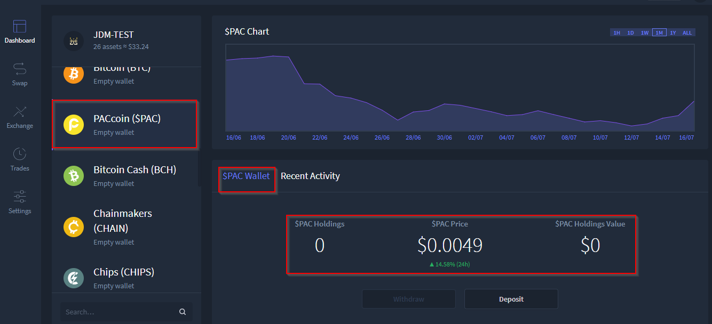

c. $PAC coin added to the Exchange view

.. image:: images/HyperDEX-0.1.0-alpha.10/image15.png
   :align: center
   :scale: 75 %

7. Add Rapture (RAP) currency. `Commit Details <https://www.google.com/url?q=https://github.com/atomiclabs/hyperdex/commit/478bb9184facd71ba576bf34e31ff11e87f892ec&sa=D&ust=1532159827399000>`__

a. RAP coin added to the Settings coin list

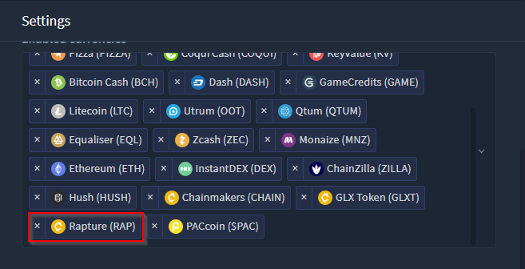

b. RAP coin added to the Dashboard view

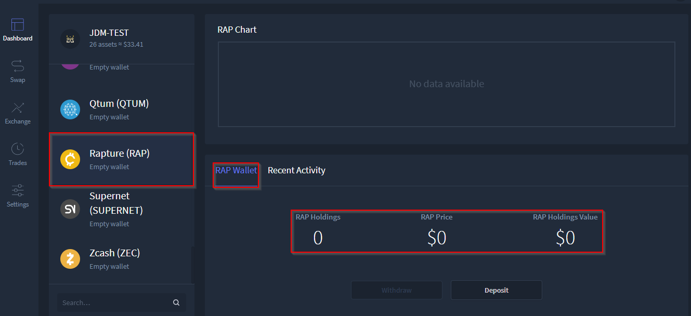

c. RAP coin added to the Exchange view

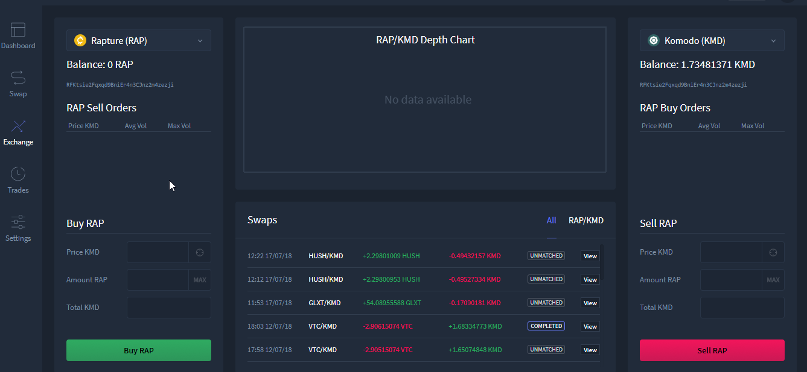

8. Update some Electrum servers. **Dev Only** `Commit Details <https://www.google.com/url?q=https://github.com/atomiclabs/hyperdex/commit/ca9479058d0b94a3c34228c9c148a71e928b3643&sa=D&ust=1532159827400000>`__

9. Reset inputs in the Exchange view when currency changes. `Commit Details <https://www.google.com/url?q=https://github.com/atomiclabs/hyperdex/commit/98f53c289cda974cf2b51a85756a11ea9c2521e7&sa=D&ust=1532159827401000>`__

a. When changing currencies in the Exchange view, in either Buy or Sell sections, all inputs will now be cleared

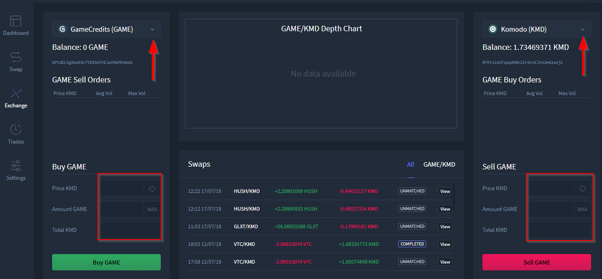

10. Update to `BarterDEX Marketmaker v1.0.315 <https://github.com/artemii235/SuperNET/releases/tag/v1.0.315>`_. `Commit Details <https://github.com/atomiclabs/hyperdex/commit/b37b40e1368587df98820e8cccd4539f8fe365ed>`__

Fixes
=====

* Fix order selection calculation. `Commit Details <https://github.com/atomiclabs/hyperdex/commit/87fa8242cb863286675abed10c44478631397651>`__

    * A fix has been implemented to increase the order match rate

* Fix Portfolio menu being visible even when logging out. `Commit Details <https://github.com/atomiclabs/hyperdex/commit/406c7d1276b629390b4054c295d1faa64c6ced99>`__

* Fix the dropdown of the currency selector being cut off and make settings scrollable. `Commit Details <https://github.com/atomiclabs/hyperdex/commit/90cbbb6477b302b19575f02cf45ecef5ad7a1544>`__

    * The Setting view now includes an inner scroll which now allows an easy view of all options, including the theme setting and logout option

.. image:: images/HyperDEX-0.1.0-alpha.10/image20.png
   :align: center
   :scale: 75 %
