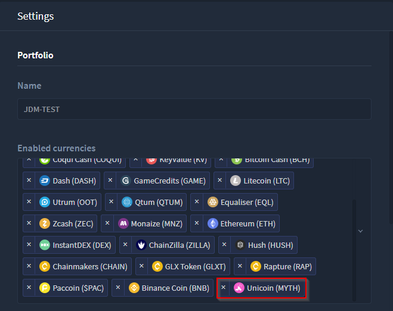
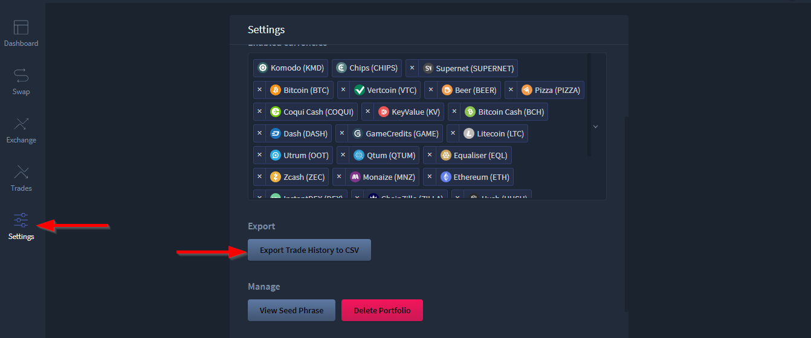
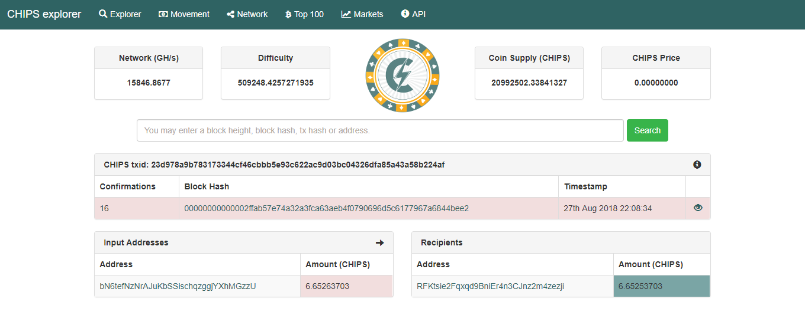
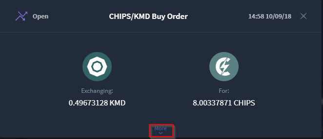
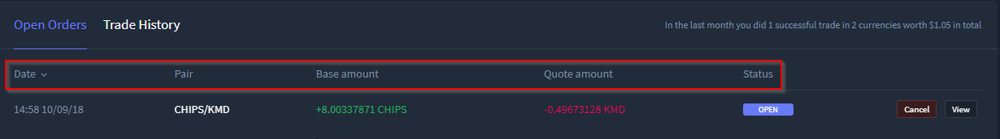
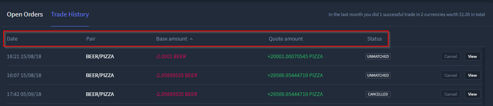
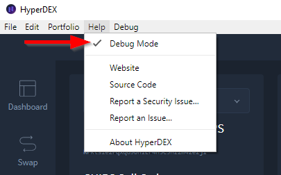
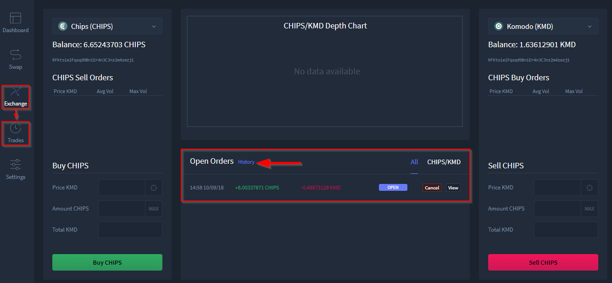
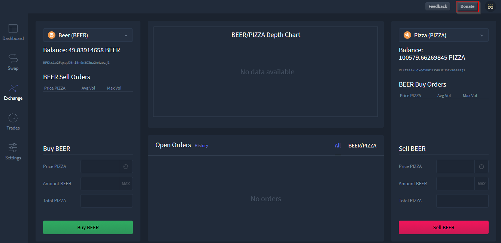
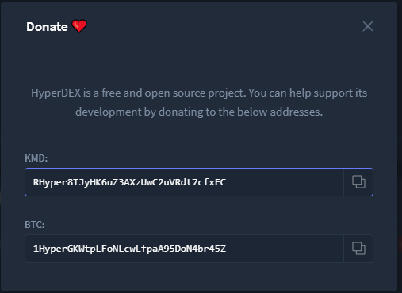

************************************
HyperDEX-0.1.0-alpha.12-Enhancements
************************************

1. Add Unicoin (MYTH) to default currencies. `Commit Details <https://github.com/atomiclabs/hyperdex/commit/77795327dd1fed260f63a046cbe128a8a7588303>`__ 

a. The MYTH coin is now available in the enabled currencies in the Settings view 

2. Add ability to export trade history to CSV. For example, for use in Excel. (`Github #450 <https://github.com/atomiclabs/hyperdex/pull/450>`_) `Commit Details <https://github.com/atomiclabs/hyperdex/commit/5bb5c3b912ff1a285690cd60abbf010ed0ee3cff>`__

a. The export trade history button may be found in the Settings view

b. A file browser will appear for you to save the CSV

.. image:: images/HyperDEX-0.1.0-alpha.12/image3.png
   :align: center
   :scale: 75 %

3. In the swap details modal, link transactions to block explorer web pages. (`Github #453 <https://github.com/atomiclabs/hyperdex/pull/453>`_) `Commit Details <https://github.com/atomiclabs/hyperdex/commit/7bd964460f005b1a3cc04f01cc9f2fbfdceaf998>`__ 

a. Once a swap has completed successfully Alice/Bob payment may now be selected

.. image:: images/HyperDEX-0.1.0-alpha.12/image4.png
   :align: center
   :scale: 75 %

b. After selecting a Alice/Bob tx the explorer will now be opened

4. Swap details modal tweaks. `Commit#1 <https://github.com/atomiclabs/hyperdex/commit/6654b8d70f9031ea00bfc1115124ec9346f34929>`__ `Commit#2 <https://github.com/atomiclabs/hyperdex/commit/5e7512d7da4dad04478702cf106e846e8139bc2b>`__

a. The swap details windows has been redesigned with a the ability to show or hide details within the broadcasted order and a graphics update between coins

.. image:: images/HyperDEX-0.1.0-alpha.12/image7.png
   :align: center
   :scale: 75 %

5. Add "Help" menu item to report security issues. `Commit Details <https://github.com/atomiclabs/hyperdex/commit/cfdbb9af64a90b753849e4f9885fe7d4cfd2bf13>`__

a. 

.. image:: images/HyperDEX-0.1.0-alpha.12/image8.png
   :align: center
   :scale: 75 %

b. Once selected your mail client will open and a new email will be created to send to `hyperdex@protonmail.com <hyperdex@protonmail.com>`_;

6. Add ability to sort orders in the Trades view. `Commit Details <https://github.com/atomiclabs/hyperdex/commit/d505b8e93da4248cc40504dfbff5ef5520d7a9b5>`__ 

a. In both Open Orders and Trade History tabs of the Trades view you may sort all trades by selecting any column header

7. GTC orders. `Commit Details <https://github.com/atomiclabs/hyperdex/commit/0040d040fb988100cd0052dc97a41d2b6574524b>`__ 

a. All orders are now Good 'Till Cancelled (GTC) orders. If you place an order it will stay pending and keep re-broadcasting the order every 10 minutes until it either matches or the user cancels it. `Read more <https://github.com/atomiclabs/hyperdex/pull/481>`__. 

8. Disable Debug Mode by default in production. You can re-enable it in the Help menu. `Commit Details <https://github.com/atomiclabs/hyperdex/commit/e00eff53cc68a5fe25281f08be51eb835dbf7697>`__  

a.

9. Only show open orders on the exchange view. `Commit Details <https://github.com/atomiclabs/hyperdex/commit/a95f25675a34ea9ada82b531e2fabfe76fba6ec7>`__ 

a. Because of GTC, we now only show open orders in the Exchange view. Go to the Trades view to view completed/failed orders.

10. Add donate button. `Commit Details <https://github.com/atomiclabs/hyperdex/commit/e2660ef3dd3d910e756f4dd6db8e1307da2cfc0c>`__

a. A donate button has been added to a fixed position adjacent to the feedback button

	
b. A window will appear with a deposit address, please support!!

Fixes
=====

	* Fix duplicate labels in the portfolio charts. (`Github #443 <https://github.com/atomiclabs/hyperdex/pull/443>`_) `Commit Details <https://github.com/atomiclabs/hyperdex/commit/2c9df69aa66928a7217b3429de5c60df413f1d02>`__
	* Fix icon for Trades view. `Commit Details <https://github.com/atomiclabs/hyperdex/commit/36725ecb8cc676fbf6e81d5ed504efd10c216c3f>`__
	* Fix window height on Linux. `Commit Details <https://github.com/atomiclabs/hyperdex/commit/631e3b287cc1ef3acdbe61f2405aff4a298706c2>`__

Dev Only
========

	* Switch from CoinMarketCap API to CoinGecko. No more CoinMarketCap-related errors. `Commit Details <https://github.com/atomiclabs/hyperdex/commit/dbecfaf3ae1efdd621df1536009659a78d77df0e>`__
	* Improve handling of Marketmaker crashing or being unavailable during login. `Commit Details <https://github.com/atomiclabs/hyperdex/commit/f12fe3c39207b738731d003d9678628180543dd7>`__
	* Support for `ERC20 tokens <https://en.wikipedia.org/wiki/ERC-20>`_. `Commit Details <https://github.com/atomiclabs/hyperdex/commit/cbfce65f47e6dbc664e61986353171fbe3aa883f>`__
	* New Crowdin translations. `Commit Details <https://github.com/atomiclabs/hyperdex/commit/3a56e466f3152a62c74d9127ea452e511be6899f>`__ 
	* Update to `BarterDEX Marketmaker v1.0.543 <https://github.com/artemii235/SuperNET/releases/tag/v1.0.543>`_. `Commit Details <https://github.com/atomiclabs/hyperdex/commit/34d88e4da1ec1ca96ddcb5695f2f5669b00080c0>`__
	* Improve login performance. `Commit Details <https://github.com/atomiclabs/hyperdex/commit/8aec0faf4466ed28db0346d074fe18dd48483311>`__ 
	* Render numbers with decimal instead of exponential notation in number input fields. (`Github #434 <https://github.com/atomiclabs/hyperdex/pull/434>`_) `Commit Details <https://github.com/atomiclabs/hyperdex/commit/8c612c52b307aa972ef3a27b3afb1ed0bdec0d97>`__ 
	* Make the hit-target for the modal close button larger. `Commit Details <https://github.com/atomiclabs/hyperdex/commit/ece080d2061e43e4a2b37d58830de8b70212796a>`__
	* Add initial macOS Touch Bar support. `Commit Details <https://github.com/atomiclabs/hyperdex/commit/d494ad43f6a9fbcf95b476fad77c97db1fdd93d1>`__ 
	* Translation updates. (`Github #448) <https://github.com/atomiclabs/hyperdex/pull/448>`_ `Commit Details <https://github.com/atomiclabs/hyperdex/commit/e20fa6d33bb3c914622e18004e2619f95b35c63b>`__
 
