***********************************
HyperDEX-0.1.0-alpha.2-Enhancements
***********************************
	
1. Various user-interface improvements. Larger text in some places. Less scrollbars.

2. Added the Denarius (DNR) currency.

a. Denarius currency is now accessible on the Settings screen

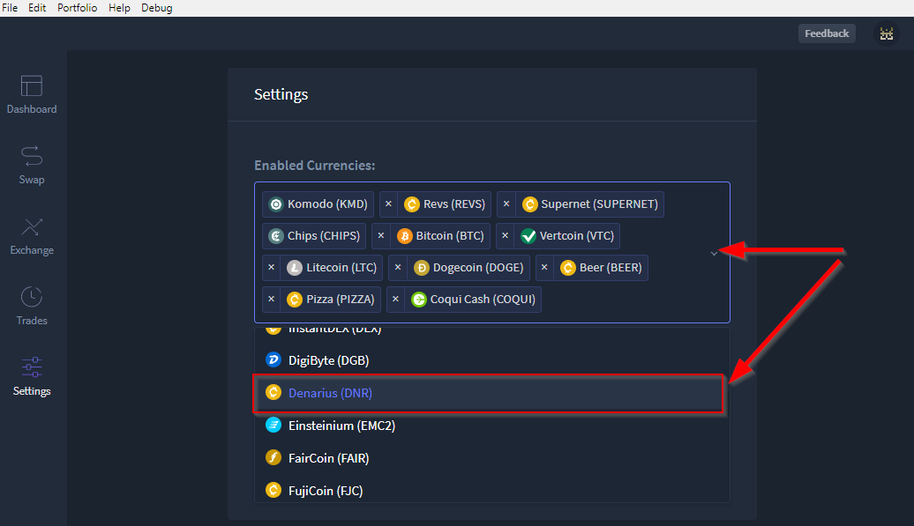
		
b. Once added, it is now visible in the Dashboard.

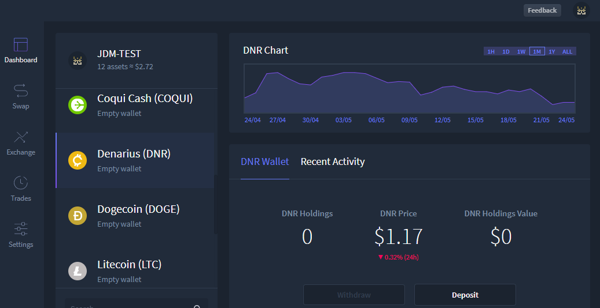

c. Also when added, DNR is available for trading.

.. image:: images/HyperDEX-0.1.0-alpha.2/image3.png
   :align: center
   :scale: 75 %

3. Fixed the Electrum port for BTCH and CRYPTO. - **Dev Only**

4. Fixed a problem with typing zero after a decimal point in input fields.
		
a. User is now able to enter integers (original bug listed zeros only) in the buy/sell fields of the exchange.

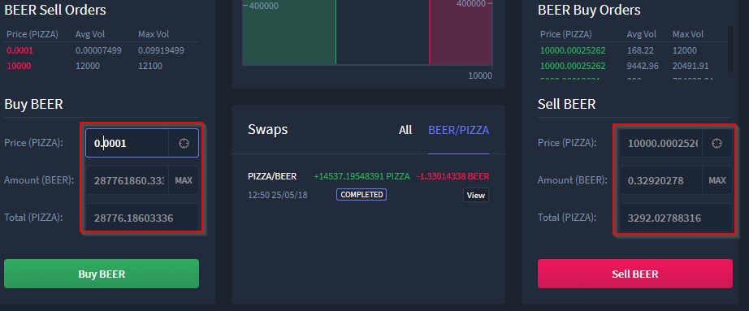

5. The SnowGem currency ticker was incorrect and was changed from SNG to XSG. You need to enable it again if you had it enabled previously.

a. SnowGem ticker updated to XSG in all relevant locations

b. Settings

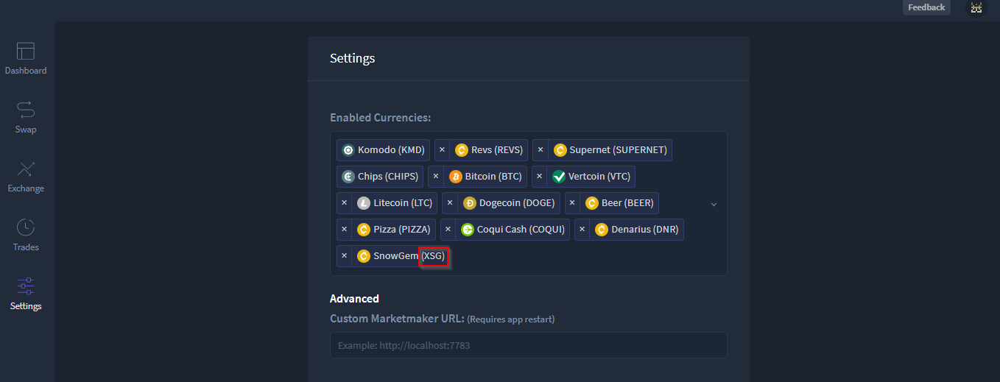

c. Dashboard

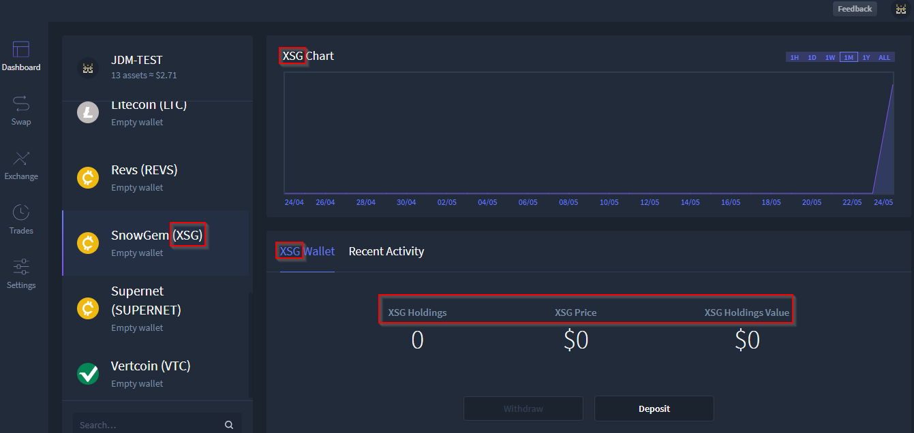

d. Exchange

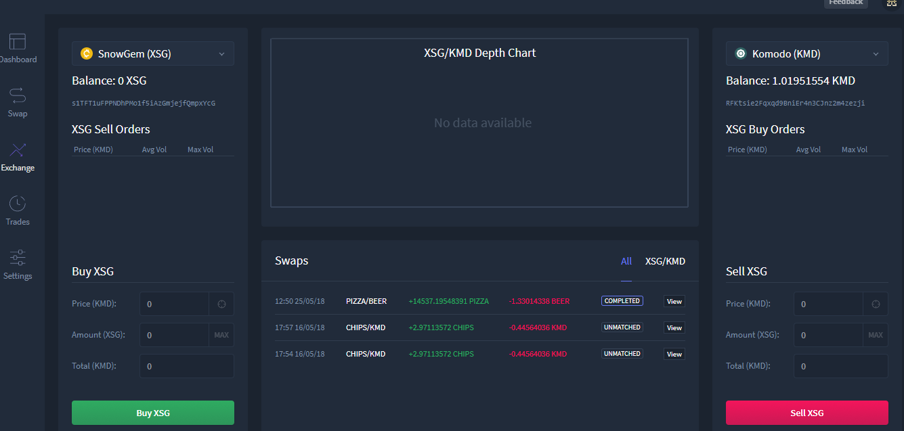

6. The HODL and HODLC currencies are temporarily removed while we sort out some confusion.        

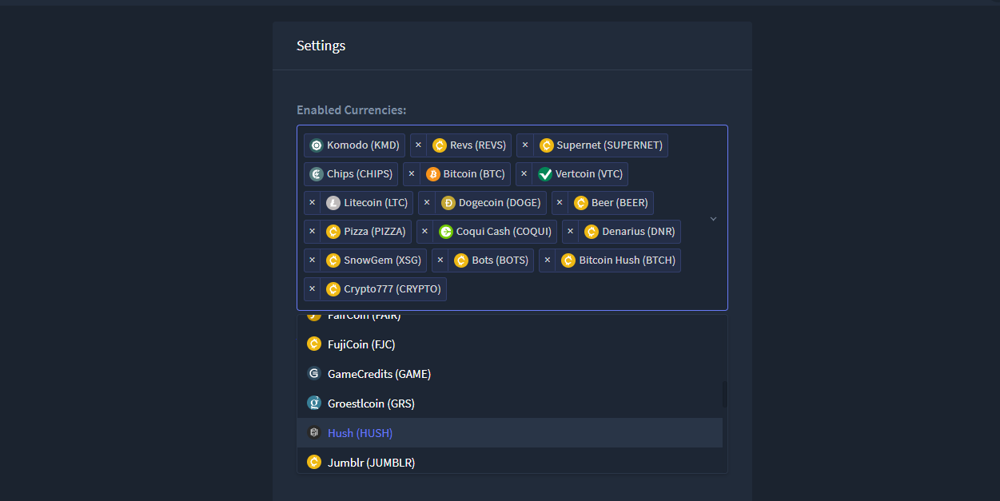

7. "View" button is now shown in the "Open Orders" view too.

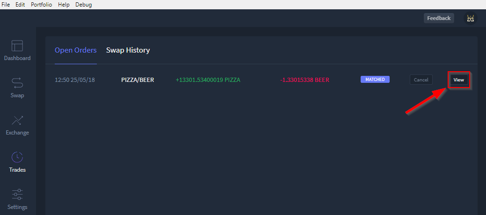

.. image:: images/HyperDEX-0.1.0-alpha.2/image10.png
   :align: center
   :scale: 75 %

8. Added a ``Copy Swap Debug Data`` button to the swap modal dialog, so you can more easily share debug data with us.

a. The ``Copy Swap Debug Data`` button has been added to the swap dialog from the view button of the swap.

.. image:: images/HyperDEX-0.1.0-alpha.2/image11.png
   :align: center
   :scale: 75 %

b. Once copied, paste into desired location (in this example Notepad)

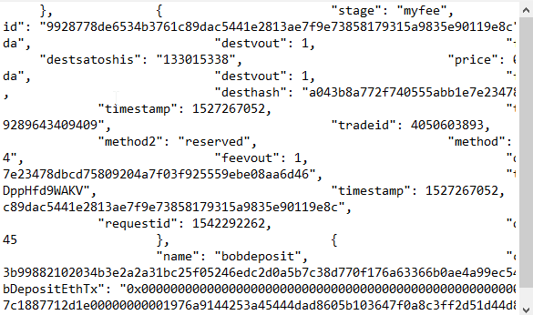

9. PIZZA and BEER no longer show a price since they're just test currencies.

a. BEER now shows $0 value

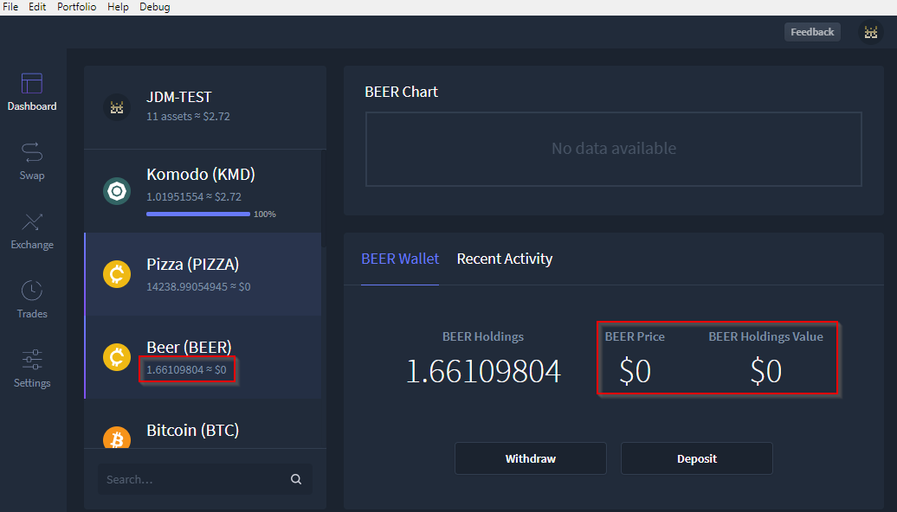

b. PIZZA now shows $0 value

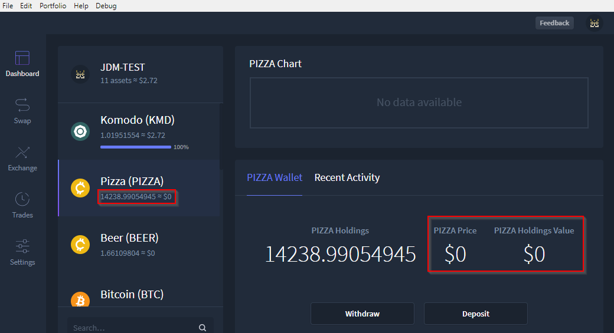
