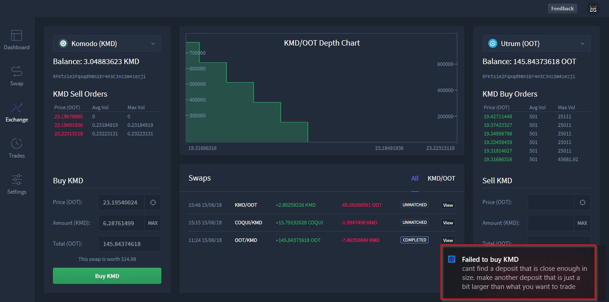

***********************************
HyperDEX-0.1.0-alpha.6-Enhancements
***********************************

1. Support for the `Equaliser (EQL) <https://equaliser.org/>`_ currency. 

a. Equaliser (EQL) coin added in Settings view.

.. image:: images/HyperDEX-0.1.0-alpha.6/image1.png
   :align: center
   :scale: 75 %

b. Once added, the ``EQL`` coin will be displayed in your portfolio

.. image:: images/HyperDEX-0.1.0-alpha.6/image2.png
   :align: center
   :scale: 75 %

c. EQL coin available in Exchange view

.. image:: images/HyperDEX-0.1.0-alpha.6/image3.png
   :align: center
   :scale: 75 %

2. Displays order failures using a system notification.

a. Order failures with an explanation will now be displayed by the app in the bottom right of the screen

3. Shows the worth of a swap in USD in the order column in the Exchange view. 
a. Swap worth is displayed above Buy button in the Exchange view

.. image:: images/HyperDEX-0.1.0-alpha.6/image5.png
   :align: center
   :scale: 75 %

b. Swap worth is displayed above Sell button in Exchange view

.. image:: images/HyperDEX-0.1.0-alpha.6/image6.png
   :align: center
   :scale: 75 %

4. Fixed a crash caused by number some inputs having the incorrect data type.

a. An error existed during swaps where inputs were sometimes treated as an integer and other times treated as a string. This issue has been resolved and can be referenced in `issuue #342 <https://github.com/lukechilds/hyperdex/issues/342>`_

5. Now gracefully handles Electrum errors. 

a. System notifications will now be displayed in place of code errors.

6. Added a debug menu item to delete swap history. 
a. To delete swap history from the exchange view select the debug menu option then select Delete Swap History

.. image:: images/HyperDEX-0.1.0-alpha.6/image7.png
   :align: center
   :scale: 75 %

7. Updated to BarterDEX Marketmaker v1.0.238

a. Marketmaker has now been updated and can be referenced here: `Link to Github <https://github.com/artemii235/SuperNET/releases/tag/v1.0.238>`_
