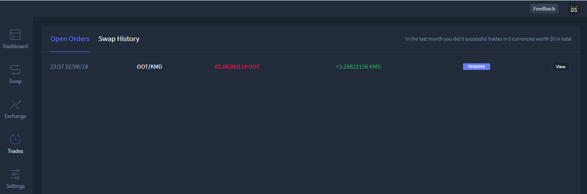
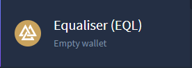
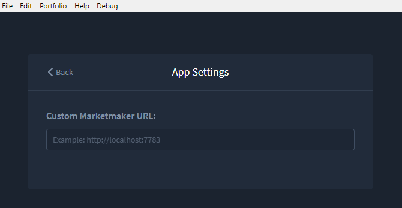

***********************************
HyperDEX-0.1.0-alpha.8-Enhancements
***********************************

1. We have decided to remove the "Cancel" button from the Trades view. It was not working as expected and it doesn't look like it going to be possible to fix it until Marketmaker v2 (which will not be done soon). `Commit details <https://github.com/hyperdexapp/hyperdex/commit/60d9feecda1449222ac914f92e247b6e2cf54957>`_

2. Enable the EQL currency by default. `Commit details <https://www.google.com/url?q=https://github.com/hyperdexapp/hyperdex/commit/280f7ddad60b7059cc63bd4d4a54b801bf10d2e3&sa=D&ust=1531137757860000>`__

a. The Equaliser (EQL) coin is now a default active coin upon app install

.. image:: images/HyperDEX-0.1.0-alpha.8/image2.png
   :align: center
   :scale: 75 %

3. Update to BarterDEX `Marketmaker v1.0.270 <https://github.com/artemii235/SuperNET/releases/tag/v1.0.270>`_ which contains a bug fix to improve order match rate.

a. Further details on this marketmaker update may be found here:

b. `Commit details <https://github.com/hyperdexapp/hyperdex/commit/74624bbdc8a01c55b366f7698542a33b57d1b5df>`__

c. `Marketmaker download <https://github.com/artemii235/SuperNET/releases>`_

4. Improve Content Security Policy `Commit details <https://github.com/hyperdexapp/hyperdex/commit/5d2751566ac8f305d9df5c5c214cf09bbe7e942a>`__

5. Add translation files `Commit details <https://www.google.com/url?q=https://github.com/hyperdexapp/hyperdex/commit/00b4f84a8a6426d147c9244a66a458122f41fbd1&sa=D&ust=1531137757863000>`__
 
6. Correctly handle inverse values for sell orders. `Commit details <https://www.google.com/url?q=https://github.com/hyperdexapp/hyperdex/commit/167b89284c6623ae261219710e07973d54cef53e&sa=D&ust=1531137757864000>`__

a. Requested order values were displayed in reverse where the intended buy coin displayed as the intended sell coin. This has been corrected. More detailed information may be found here - https://github.com/hyperdexapp/hyperdex/issues/361

7. Add icons for currencies BCBC, MNZ, DNR, EQL `Commit details <https://www.google.com/url?q=https://github.com/hyperdexapp/hyperdex/commit/3e3ff118c567a4b3e1b8b6547eb484d14d8696f2&sa=D&ust=1531137757865000>`__

a. BCBC icon

.. image:: images/HyperDEX-0.1.0-alpha.8/image3.png
   :align: center
   :scale: 75 %

b. MNZ icon

.. image:: images/HyperDEX-0.1.0-alpha.8/image4.png
   :align: center
   :scale: 75 %

c. DNR icon

.. image:: images/HyperDEX-0.1.0-alpha.8/image5.png
   :align: center
   :scale: 75 %

d. EQL icon

8. Split Settings into Portfolio and App Settings.

a. In the Settings view there are now two sections: Portfolio and App. To get to App settings select the Logout link or from the login page select ``Portfolio -> Settings``

.. image:: images/HyperDEX-0.1.0-alpha.8/image7.png
   :align: center
   :scale: 75 %

b. After either select the Logout link or selecting ``Portfolio -> Settings`` from the login page the App settings will be displayed allowing a custom market maker URL to be entered

9. Add some stats to the Trades view. `Commit details <https://www.google.com/url?q=https://github.com/hyperdexapp/hyperdex/commit/7d996b46533bc965409f53150b9b037731bc040c&sa=D&ust=1531137757868000>`__

a. In the ``Trades -> Open Orders`` view, a record of number of trades, number of currencies, and fiat value are now displayed in the top right corner

Fixes
=====

* Fix issue when clicking the "Max" button in the withdraw modal. `Commit details <https://www.google.com/url?q=https://github.com/hyperdexapp/hyperdex/commit/37a35f53d3b87be547017337d965f06ca0d767d0&sa=D&ust=1531137757870000>`__
* Fix stuck pending swaps. `Commit details <https://www.google.com/url?q=https://github.com/hyperdexapp/hyperdex/commit/0ed0acdf2638b0b628099a8753a4d4049d3b6833&sa=D&ust=1531137757870000>`__
* Fix not being able to type space in the seed phrase input. `Commit details <https://www.google.com/url?q=https://github.com/hyperdexapp/hyperdex/commit/856c9715b99596dbabfbebb373b9886f185cf25b&sa=D&ust=1531137757871000>`__
* Fix USD calculation in the withdraw modal. `Commit details <https://www.google.com/url?q=https://github.com/hyperdexapp/hyperdex/commit/a4fec46296178d58b47183fa1f1f557c054418b6&sa=D&ust=1531137757871000>`__
* Fix problem with having currencies with a number in the name enabled.     `Commit details <https://www.google.com/url?q=https://github.com/hyperdexapp/hyperdex/commit/e6b435b6ccd27be24b3da566e899a0e014afd2da&sa=D&ust=1531137757872000>`__

