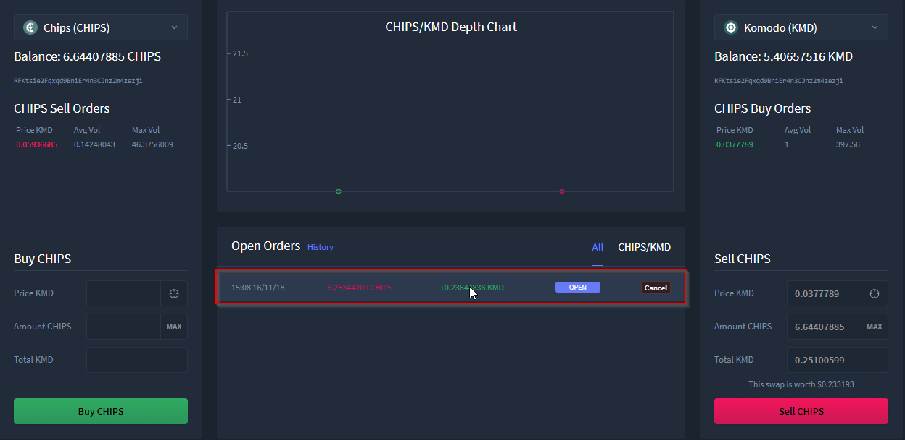
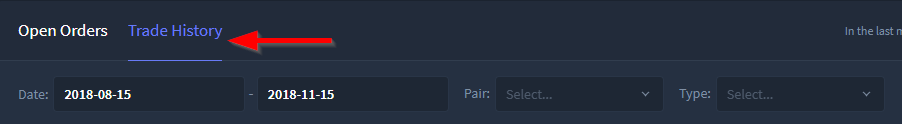
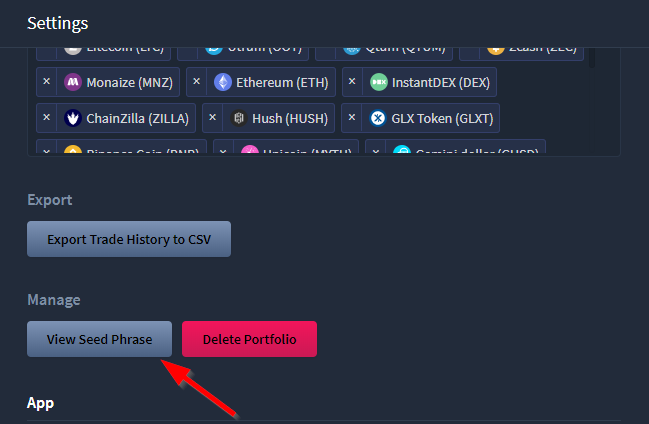
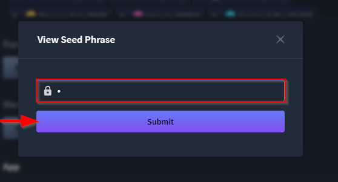
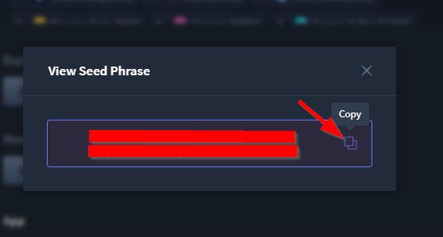
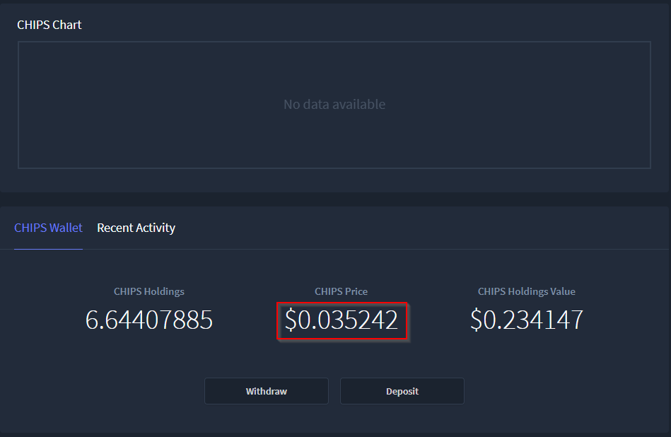
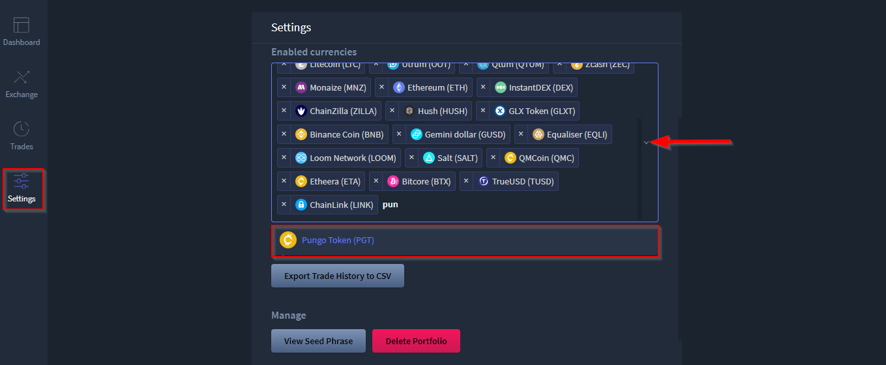
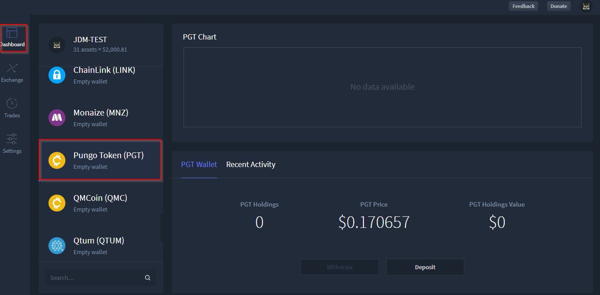

***************************
HyperDEX-0.3.0-Enhancements
***************************

1. Make the swap list rows clickable. You now click anywhere in the row instead of the "View" button. Commit Details

2. Add filters to the trade history. Commit Details

a. Within the Trade History of Trades view you may now filter by date (yyyy-mm-dd), order pair, and order type (buy or sell)
    

3. Add a copy button to the modal that shows your seed phrase. Commit Details

a. A copy function has now been added when retrieving your seed, to do so first go to the Settings view

b. Once selected a prompt will appear for passphrase entry, enter your passphrase then select Submit

c. Now your passphrase will be shown with the ability to copy it

4. In the Dashboard view, show 6 fractional digits for currencies worth less than 1. Commit Details

5. Add Pungo Token (PGT) currency. Commit Details

a. Pungo Token (PGT) may now be added in the Settings view

b. Once added in the Settings view PGT will be available in the Dashboard view

6. Move enabled currencies from the app settings to the portfolio data. It is automatically migrated. This means portfolios can have different enabled currencies. Commit Details

Fixes
=====

    * Fix a small zero being accidentally shown after the wallet currency price. Commit Details
    * Fix the price history fetching error handling. Commit Details
    * Fix the dashboard price history graph. Commit Details

Dev Only
========

    * Update to BarterDEX Marketmaker v1.0.1026. Commit Details
    * Remove DNR, ARG, MAC, and CALL currencies. See #577 (comment). Commit Details
    * Update LTC and BCH Electrum servers. Commit Details
