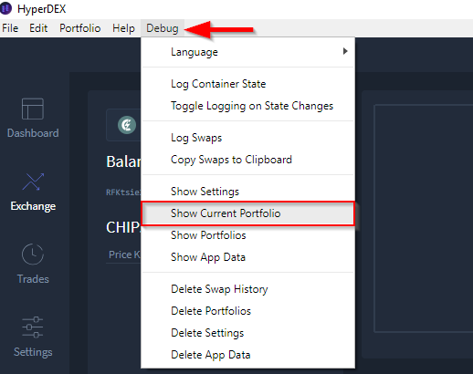

***************************
HyperDEX-0.4.0-Enhancements
***************************

1. Add "Debug" menu item to show the file of the current portfolio (`#579 <https://github.com/atomiclabs/hyperdex/pull/579>`__) `Commit details <https://github.com/atomiclabs/hyperdex/commit/e1aae1f875eb5d283f0e3f8625f6ed0d3faa419b>`__

a. The new option “Show Current Portfolio” will now open the the active portfolio json file for viewing

Dev Only
========

    * Drop support for macOS 10.9 `Commit details <https://www.google.com/url?q=https://github.com/atomiclabs/hyperdex/commit/4600c1acb7c8c3fed2a9afc5639aeb1201b56c80&sa=D&ust=1548670273059000>`__
        * Only macOS 10.10 and above are supported now.
    * Remove QMC currency (Its Electrum servers are down) `Commit details <https://www.google.com/url?q=https://github.com/atomiclabs/hyperdex/commit/6c706d99e437ea370d3af7026b31db5a4deda80e&sa=D&ust=1548670273060000>`__
    * Remove BCBC currency (Its Electrum servers are down) `Commit details <https://www.google.com/url?q=https://github.com/atomiclabs/hyperdex/commit/ca25377006d6975322dceeec850b8fb005aaf872&sa=D&ust=1548670273060000>`__
    * Update Electrum servers and some currency data (`#588 <https://www.google.com/url?q=https://github.com/atomiclabs/hyperdex/pull/588&sa=D&ust=1548670273060000>`__) `Commit details <https://www.google.com/url?q=https://github.com/atomiclabs/hyperdex/commit/ca25377006d6975322dceeec850b8fb005aaf872&sa=D&ust=1548670273061000>`__
    * Update to BarterDEX Marketmaker v1.0.1096 `Commit details <https://www.google.com/url?q=https://github.com/atomiclabs/hyperdex/commit/b3c6f0b450663f6d92c267bef918142d218eecb4&sa=D&ust=1548670273061000>`__

